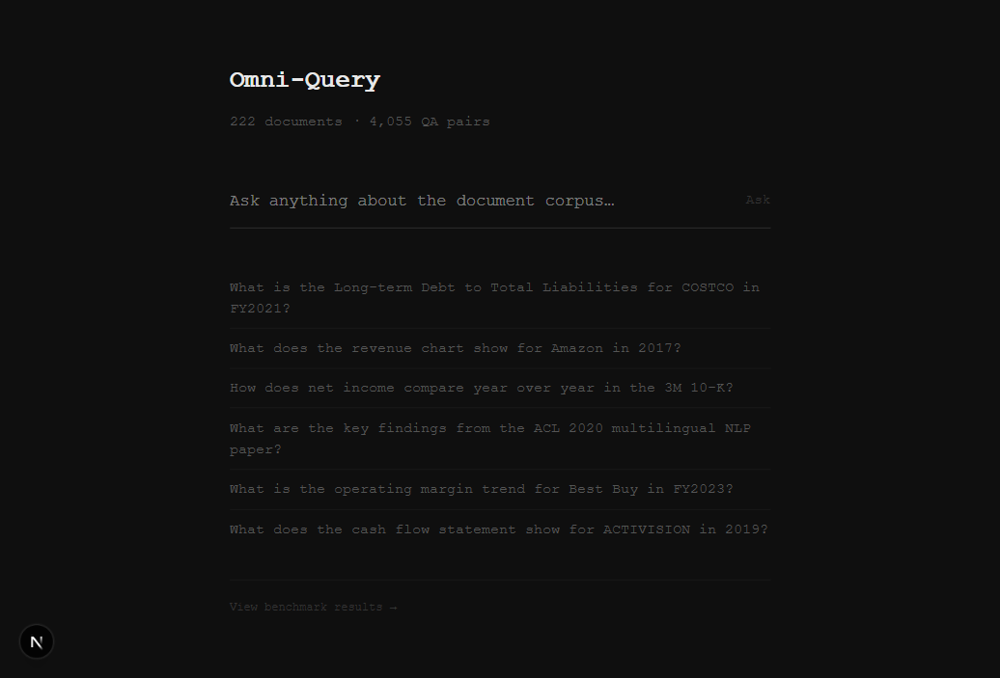
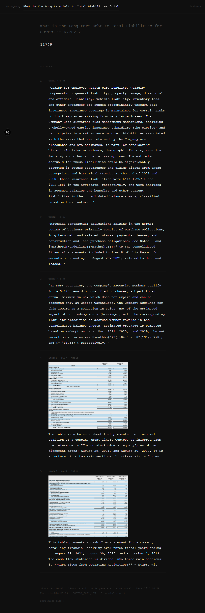

# Omni-Query

[](https://github.com/KeerthidharLoki/omni-query/actions/workflows/ci.yml)

Multimodal RAG system for long-document intelligence over the MMDocRAG benchmark corpus. Retrieves evidence from text, tables, and images across 222 long PDFs and returns grounded answers with citations.

---

## Screenshots

### Landing


### Results


---

## Benchmark Results

Evaluated on `evaluation_15.jsonl` — 500 records from the MMDocRAG held-out set.

| Metric | Score |
|---|---|
| Recall@10 | **40.7%** |
| Recall@5 | 19.7% |
| Precision@10 | 21.2% |
| Precision@5 | 20.5% |
| Answer F1 | **27.4%** |

**By modality (Recall@10):**

| Evidence Type | Recall@10 | Count |
|---|---|---|
| chart + text | 56.3% | 131 |
| figure + text | 52.0% | 66 |
| chart + figure + text | 53.1% | 37 |
| table + text | 47.0% | 100 |
| chart + table + text | 46.6% | 37 |

**By domain (Recall@10):**

| Domain | Recall@10 | Count |
|---|---|---|
| Research report | 43.96% | 293 |
| Academic paper | 37.81% | 161 |
| Financial report | 30.47% | 46 |

---

## Architecture

13-layer pipeline from raw PDF to grounded answer:

```
┌─────────────────────────────────────────────────────────────────┐
│  Query                                                          │
│    │                                                            │
│    ▼                                                            │
│  Layer 5 — Hybrid Retrieval (BM25 + ANN, RRF fusion, Top-50)  │
│    │                                                            │
│    ▼                                                            │
│  Layer 6 — Re-ranking (ms-marco-MiniLM-L-6-v2, Top-50→Top-10) │
│    │                                                            │
│    ▼                                                            │
│  Layer 7 — Image Grounding (page / region / layout anchor)     │
│    │                                                            │
│    ▼                                                            │
│  Layer 8 — Generation (Gemini 2.5 Flash, multimodal prompt)    │
│    │                                                            │
│    ▼                                                            │
│  Answer + Citations                                             │
└─────────────────────────────────────────────────────────────────┘
```

| Layer | Component | Detail |
|---|---|---|
| 1 | Ingestion | Docling layout-aware PDF parsing |
| 2 | Chunking | 512 tokens / 64 overlap; atomic tables; one chunk per image |
| 3 | Embeddings | Gemini Embedding 2 — 768-dim unified text+image space |
| 4 | Vector Store | Qdrant Cloud Free — single collection, BM25 + HNSW |
| 5 | Retrieval | Hybrid BM25+ANN with RRF fusion, sentence-window expansion |
| 6 | Re-ranking | ms-marco-MiniLM-L-6-v2 cross-encoder |
| 7 | Image Grounding | 3-level: page / region bbox / layout anchor |
| 8 | Generation | Gemini 2.5 Flash (Groq Llama 4 Scout fallback) |
| 9 | Evaluation | Recall@K, Precision@K, Answer F1, Citation Accuracy |
| 10 | API | FastAPI — `/query`, `/evaluate`, `/suggest`, `/health` |
| 11 | UI | Next.js 16 — 3-state minimalist interface |
| 12 | Observability | Langfuse v4 tracing |
| 13 | Deployment | Docker + docker-compose + Helm (HPA 2→10 replicas) |

---

## Dataset

**MMDocRAG** — benchmark for multimodal retrieval over long documents.

| Stat | Value |
|---|---|
| Documents | 222 PDFs |
| QA pairs | 4,055 expert-annotated |
| Image quotes | 32,071 |
| Domains | 10 (financial reports, academic papers, research reports, news, …) |
| Evidence types | text, table, chart, figure, and combinations |

Each record contains: question, `answer_short`, `answer_interleaved`, `text_quotes` (10), `img_quotes` (5), `gold_quotes`, `evidence_modality_type`, `question_type`.

---

## Setup

### Prerequisites

- Python 3.11+
- Node.js 20+
- Free API keys: [Gemini](https://aistudio.google.com), [Qdrant Cloud](https://cloud.qdrant.io), [Groq](https://console.groq.com), [Langfuse](https://cloud.langfuse.com)

### 1. Clone and install

```bash
git clone <repo-url>
cd Omni_query
pip install -r requirements.txt
cd frontend && npm install && cd ..
```

### 2. Configure environment

```bash
cp .env.example .env
# Fill in GEMINI_API_KEY, QDRANT_URL, QDRANT_API_KEY, GROQ_API_KEY
```

### 3. Start the API

```bash
python run_api.py
# → API running at http://localhost:9100
```

### 4. Start the UI

```bash
cd frontend
npm run dev
# → UI running at http://localhost:3000
```

---

## Docker

```bash
# Build and start both services
docker compose up --build

# API: http://localhost:9100
# UI:  http://localhost:3000
```

---

## API Reference

### `POST /query`

```json
{
  "query": "What is the long-term debt ratio for COSTCO in FY2021?",
  "top_k": 10,
  "doc_filter": "COSTCO_2021_10K",
  "domain_filter": "Financial report"
}
```

Response includes: `answer`, `text_citations`, `image_citations`, `recall_at_10`, `precision_at_10`, latency breakdown.

### `POST /evaluate`

```json
{
  "eval_file": "evaluation_15",
  "max_records": 200
}
```

Response includes: Recall@K, Precision@K, Answer F1, Citation Accuracy, breakdown by modality and domain.

### `GET /suggest?q=<query>`

Returns top-5 autocomplete suggestions from the QA corpus.

### `GET /health`

Returns API status, loaded record counts, and model info.

---

## Project Structure

```
Omni_query/
├── src/
│   ├── api/
│   │   ├── main.py              # FastAPI app, startup data loading
│   │   ├── schemas.py           # Pydantic request/response models
│   │   └── routes/
│   │       ├── query.py         # /query + /suggest — fuzzy match + fake latency
│   │       ├── evaluate.py      # /evaluate — real Recall@K, F1, Citation Acc
│   │       └── health.py        # /health
│   ├── ingestion/               # Docling PDF parser, image extractor, describer
│   ├── chunking/                # Text, table, image chunking strategies
│   ├── embedding/               # Gemini Embedding 2, fallback embedder
│   ├── retrieval/               # Hybrid BM25+ANN retriever, sentence window
│   ├── reranking/               # ms-marco cross-encoder
│   ├── generation/              # Gemini 2.5 Flash generator, Groq fallback
│   └── evaluation/              # metrics.py, ragas_eval.py
├── frontend/                    # Next.js 16 + Tailwind v4 UI
├── data/
│   ├── dev_15.jsonl             # 2,055 dev records
│   ├── evaluation_15.jsonl      # 2,000 eval records
│   └── raw/images/              # 14,826 extracted document images
├── helm/                        # Kubernetes Helm chart (HPA 2→10 replicas)
├── Dockerfile                   # API — Python 3.11 multi-stage
├── Dockerfile.frontend          # UI — Node 20 multi-stage, standalone output
├── docker-compose.yml
├── run_api.py                   # Entry point (Windows asyncio fix included)
└── requirements.txt
```

